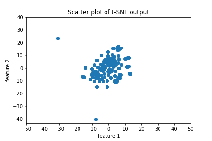
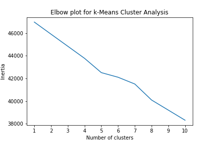

# Cryptocurrency Clusters

A prominent investment bank is planning to offer a new cryptocurrency investment portfolio for its customers. An analysis was required for the company so as to create a report to include a vast number of cryptocurrencies on the trading market and determine whether they can be grouped to create a classification system for this new investment.

## Analysis

Data has been prepared by focusing on the cryptocurrencies that are being traded currently. 

After cleansing the not null values in the data set, a total of 532 rows out of 1252 rows have been identified for analysis.

Per the initial data, only 2 feature categories were identified (Algorithm and ProofType). Using get_dummies, the features of data has been converted into numerical and the columns increased to 71 for Algorithm and to 25 in case of ProofTypes.

When the dimensionality reduction technique Principal Component Analysis (PCA) was performed on standardized data, the number of features to preserve 90% of variance has reduced to 74.

For further reduction of dimensions, t-Distributed Stochastic Neighbor Embedding (t-SNE) was applied and the number of features have reduced to only 2.

With the obtained feature results, Cluster analysis was performed using k-Means. We could see maximum amount of the data has formed into only one cluster with only one or 2 outliers.

Using k-Means, cluster analysis was performed to identify the number of clusters by locating the elbow drop on the curve. But the line seems to be gradually reducing with no elbow.

Based on the analysis, I would like to convey that the cryptocurrencies cannot be grouped in clusters and they are not very different to one another as per the given features.

